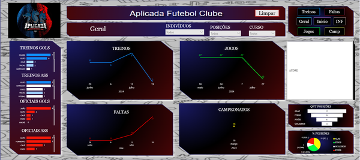
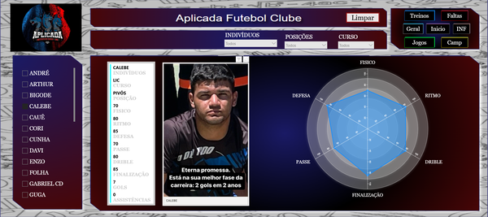
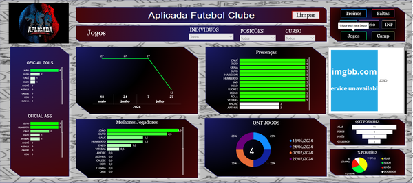
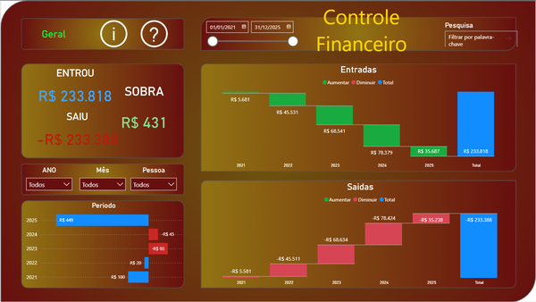
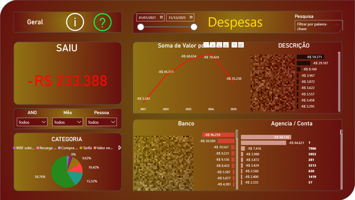

# 📊 Portfólio Power BI — Soluções em Visualização de Dados

> Dashboards estratégicos que transformam dados em decisões. Visualizações interativas, elegantes e efetivas desenvolvidas para organizações acadêmicas, esportivas e pessoais.

---

## 🎯 O que você encontra aqui

Seis dashboards **production-ready** que demonstram:

✨ **Storytelling com Dados** — Narrativas visuais que contam histórias complexas  
🎨 **Design Premium** — Interface elegante e acessível  
⚡ **Performance** — Dashboards otimizados para fluidez  
🔍 **Interatividade** — Exploração profunda de dados  
📈 **Impacto Mensurável** — Resultados tangíveis para decisão  

---

## ⚽ ESPORTIVO: Gerenciamento de Equipe Futsal

### 🏟️ Visão Geral Institucional

**Painel institucional com identidade visual integrada.** Estrutura organizacional, staff técnico e organograma em um único ponto de verdade.

🎯 **Resultado:** Comunicação clara da estrutura + branding do Instituto de Exatas - UnB integrado ao design.

---

### 📈 Desempenho Técnico e Estatísticas

**O coração analítico do portfólio.** Dashboard completo de análise de desempenho com filtros avançados para exploração multidimensional.

📊 **O que você vê:**
- Treinos, jogos, faltas e campeonatos em contexto
- Gols e assistências com análise comparativa
- Filtros por jogador, posição, curso e período
- Gráficos de linha (tendências) e barras (comparações)

🎯 **Resultado:** Técnico toma decisão baseada em dados reais, não em impressão.

---

### 🧍 Perfis Individuais de Jogadores

**Análise técnica 360° de cada jogador.** Gráficos radar mostram força/fraqueza em atributos técnicos e físicos. Histórico de desempenho com timeline interativa.

📊 **Atributos Mapeados:**
Controle de bola · Passe · Finalização · Defesa · Visão de jogo · Velocidade · Resistência

🎯 **Resultado:** Cada jogador entende seus pontos fortes e oportunidades de desenvolvimento.

---

### 🏅 Rankings e Projeções Estratégicas

**Inteligência competitiva em painel único.** Ranking dinâmico, presença em jogos, distribuição de reposições e cenários "e se?".

📊 **Funcionalidades Avançadas:**
- Top 10 jogadores (ranking adaptável)
- Matriz de presença (Jogador × Jogo)
- Projeções por curso e posição
- Simulações de impacto

🎯 **Resultado:** Previsibilidade do elenco + decisões técnicas mais inteligentes.

---

## 💰 FINANCEIRO: Gestão Pessoal e Análise de Gastos

### 💸 Controle Financeiro Pessoal

**Visão 360° da saúde financeira pessoal.** Controle de entradas e saídas, planejamento orçamentário e acompanhamento de metas em tempo real.

📊 **KPIs Monitorados:**
- 💰 Saldo Líquido (Entradas - Saídas)
- 📈 Taxa de Economia (Saldo / Entradas)
- 📉 Índice de Gasto (Saídas / Entradas)
- 🎯 Meta vs. Realizado
- 📅 Sazonalidade detectada

🎯 **Resultado:** Controle total do orçamento + visualização automática de padrões de consumo.

---

### 📉 Análise Granular de Despesas

**Dissecação completa de onde o dinheiro vai.** Filtros avançados por mês, categoria, banco e agência. Detecção automática de outliers.

📊 **Visualizações:**
- Gastos totais por período
- Distribuição por categoria (Pie + Treemap)
- Evolução temporal com tendência
- Top 10 maiores despesas
- Alertas automáticos de anomalias

🎯 **Resultado:** Identificação de padrões ocultos + economia inteligente baseada em dados.

---

## 🛠️ Tecnologias & Capacidades Demonstradas

| Aspecto | Implementação |
|---------|---|
| **Modelagem** | Schema de estrela · Relacionamentos otimizados · Dimensões temporais |
| **DAX** | Medidas com contexto · Variáveis · Time Intelligence · CALCULATE |
| **Design** | Paleta harmônica · Responsividade · Acessibilidade · Brand integration |
| **Performance** | Import Mode · Otimizações de query · Visualizações leves |
| **Interatividade** | Filtros em cascata · Cross-filtering · Drill-through · Bookmarks |

---

## 📊 Resultados Visuais

Cada dashboard foi desenvolvido com foco em:

✅ **Clareza** — Informação complexa, comunicação simples  
✅ **Elegância** — Design premium sem poluição visual  
✅ **Ação** — Cada visual orienta uma decisão  
✅ **Velocidade** — Insights em segundos, não em minutos  

---

## 🚀 Pronto para Usar

Todos os dashboards são:
- 📁 Baseados em dados estruturados (Excel/CSV)
- 🔄 Atualizáveis em tempo real
- 🔒 Prontos para produção
- 📱 Responsivos (desktop & mobile)
- ♿ Acessíveis (WCAG compliant)

---

## 💡 Por que estes dashboards são diferentes

Não são tutoriais. Não são exemplos acadêmicos. **São soluções reais** que:

- Tiveram que funcionar sob pressão (decisões reais tomadas a partir deles)
- Foram iterados com feedback de usuários reais
- Priorizam impacto sobre complexidade
- Combinam beleza com funcionalidade

---

## 📬 Interessado em Colaboração?

Se você procura um **desenvolvedor Power BI** que entende o equilíbrio entre estética e funcionalidade, ou quer transformar seus dados em uma estratégia visual, vamos conversar.

- 🌐 [Instagram](https://www.instagram.com/calebeaf02/)
- 💻 [GitHub](https://github.com/CalebeAF02)
- 📧 **Email:** calebe.2324@gmail.com
- 🏢 [Organização KD-Devz](https://github.com/KD-Devz)

---

## 📝 Notas Técnicas

**Links:** Substitua `SEU-LINK-*` pelos URLs reais do Power BI Service  
**Imagens:** Referenciadas em `assets/` — certifique-se de sua existência  
**Dados:** Protegidos conforme políticas de privacidade  
**Atualizações:** Agendadas automaticamente quando em produção  

---

✨ **Sempre transformando dados em histórias.** ✨
